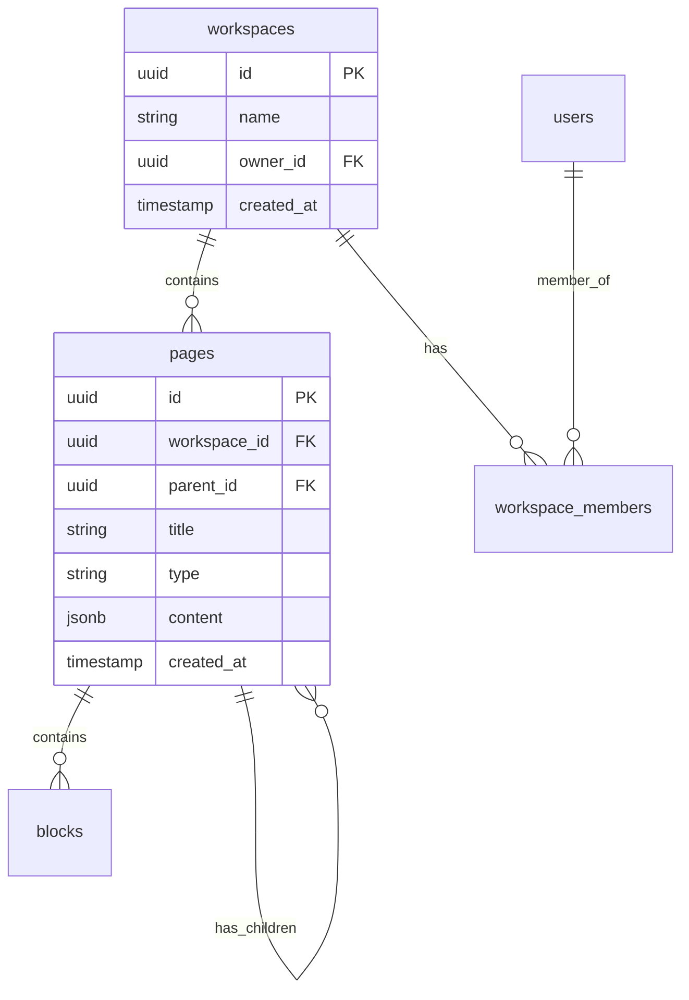

# Database Schema

This document defines the complete database schema including tables, columns, types, constraints, relationships, and indexes. It serves as the source of truth for the database structure.

**Last updated**: [Date]
**Database**: [PostgreSQL 14 / MySQL 8 / MongoDB 5 / etc.]

## Tables

### `table_name`

**Description**: [What this table stores]

**Columns**:

| Column | Type | Nullable | Default | Description |
|--------|------|----------|---------|-------------|
| id | uuid | NO | gen_random_uuid() | Primary key |
| name | varchar(255) | NO | - | [Description] |
| created_at | timestamp | NO | CURRENT_TIMESTAMP | Creation timestamp |
| updated_at | timestamp | NO | CURRENT_TIMESTAMP | Last update timestamp |

**Constraints**:
- `PRIMARY KEY (id)`
- `FOREIGN KEY (parent_id) REFERENCES parent_table(id) ON DELETE CASCADE`
- `UNIQUE (workspace_id, name)`
- `CHECK (type IN ('type1', 'type2', 'type3'))`

**Indexes**:
- `idx_table_workspace_type` on `(workspace_id, type)` - For filtering by workspace and type
- `idx_table_parent_id` on `(parent_id)` - For hierarchical queries
- `idx_table_created_at` on `(created_at DESC)` - For recent items

**DDL**:

```sql
CREATE TABLE table_name (
    id UUID PRIMARY KEY DEFAULT gen_random_uuid(),
    workspace_id UUID NOT NULL REFERENCES workspaces(id) ON DELETE CASCADE,
    parent_id UUID REFERENCES table_name(id) ON DELETE CASCADE,
    name VARCHAR(255) NOT NULL,
    type VARCHAR(50) NOT NULL,
    content JSONB,
    created_at TIMESTAMP NOT NULL DEFAULT CURRENT_TIMESTAMP,
    updated_at TIMESTAMP NOT NULL DEFAULT CURRENT_TIMESTAMP,
    UNIQUE (workspace_id, name),
    CHECK (type IN ('type1', 'type2', 'type3'))
);

CREATE INDEX idx_table_workspace_type ON table_name(workspace_id, type);
CREATE INDEX idx_table_parent_id ON table_name(parent_id);
CREATE INDEX idx_table_created_at ON table_name(created_at DESC);
```

### `another_table`

[Follow same structure as above]

## Schema diagram



## Migrations

### Migration history

| Version | Date | Description | Author |
|---------|------|-------------|--------|
| 001 | 2024-01-15 | Initial schema | [Name] |
| 002 | 2024-02-20 | Add page types | [Name] |

### Migration guidelines

When creating migrations:
1. Always include both `up` and `down` migrations
2. Test with realistic data volumes
3. Consider zero-downtime deployment (use multi-phase migrations if needed)
4. Document any required data backfill scripts
5. Note any breaking changes for dependent services

## Data types reference

**Common types used**:
- `uuid` - Primary keys and foreign keys
- `varchar(n)` - Fixed-length text fields
- `text` - Variable-length text (for long content)
- `jsonb` - Flexible structured data
- `timestamp` - Date and time values
- `boolean` - True/false flags
- `integer` - Numeric values

## Naming conventions

- **Tables**: Plural lowercase with underscores (e.g., `workspace_members`)
- **Columns**: Lowercase with underscores (e.g., `created_at`)
- **Primary keys**: Always `id`
- **Foreign keys**: `[table_singular]_id` (e.g., `workspace_id`)
- **Indexes**: `idx_[table]_[columns]` (e.g., `idx_pages_workspace_type`)
- **Constraints**: `[table]_[column]_[type]` (e.g., `pages_type_check`)

## Query patterns

### Common queries

**Get all pages in a workspace**:
```sql
SELECT * FROM pages
WHERE workspace_id = $1
ORDER BY created_at DESC;
```

**Get page hierarchy**:
```sql
WITH RECURSIVE page_tree AS (
  SELECT id, parent_id, title, 0 as level
  FROM pages
  WHERE id = $1

  UNION ALL

  SELECT p.id, p.parent_id, p.title, pt.level + 1
  FROM pages p
  INNER JOIN page_tree pt ON p.parent_id = pt.id
)
SELECT * FROM page_tree;
```

## Notes

[Additional notes about schema design decisions, performance considerations, or future changes]

---

## How to use this document

1. **When creating tech specs**: Reference this document for existing tables and schemas
2. **When adding tables**: Update this document with new table definitions
3. **When modifying schema**: Update the relevant section and document the migration
4. **When writing queries**: Reference the indexes to ensure efficient queries

This document should be updated whenever:
- New tables are added
- Columns are added, removed, or modified
- Indexes are created or dropped
- Constraints are added or changed
- Migrations are run
