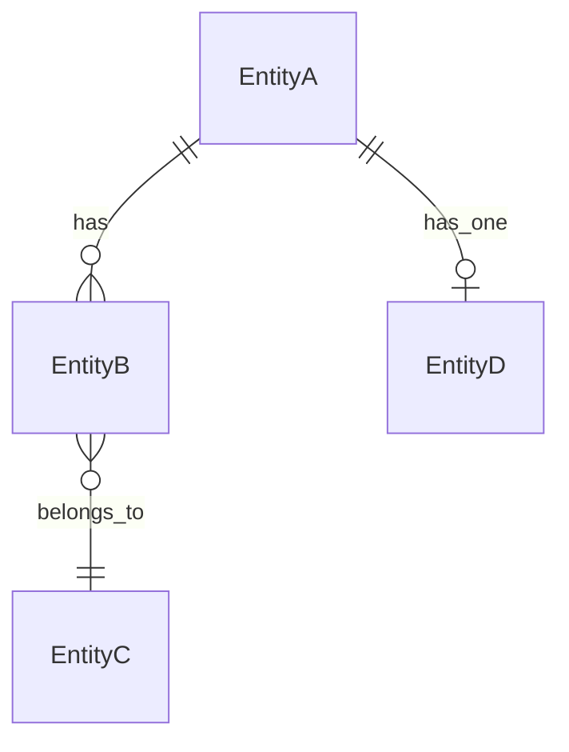

# Domain Model

This document defines the core domain entities, their relationships, and business rules for the application. It serves as the source of truth for what domain concepts exist and how they relate to each other.

**Last updated**: [Date]

## Core entities

### [Entity Name]

**Description**: [Brief description of what this entity represents in the domain]

**Key attributes**:
- `id` - [Type] - [Description]
- `name` - [Type] - [Description]
- `created_at` - [Type] - [Description]
- `updated_at` - [Type] - [Description]

**Relationships**:
- Has many [RelatedEntity] (via [foreign_key])
- Belongs to [ParentEntity] (via [foreign_key])
- Has one [RelatedEntity] (via [foreign_key])

**Business rules**:
- [Rule 1: e.g., "A Page must belong to a Workspace"]
- [Rule 2: e.g., "A Page can have at most one parent Page"]
- [Rule 3: e.g., "Deleting a Page cascades to all child Pages"]

### [Another Entity Name]

**Description**: [Brief description]

**Key attributes**:
- [List attributes]

**Relationships**:
- [List relationships]

**Business rules**:
- [List rules]

## Entity relationships diagram

[Add Mermaid ER diagram showing relationships between entities]

## Domain concepts

### [Concept Name]

**Definition**: [Explain the concept]

**Examples**:
- [Example 1]
- [Example 2]

**Related entities**: [List entities involved in this concept]

## Glossary

- **[Term]**: [Definition in the context of this domain]
- **[Term]**: [Definition in the context of this domain]

## Notes

[Any additional notes about the domain model, constraints, or decisions]

---

## How to use this document

1. **When designing features**: Check this document to understand what entities exist and their relationships
2. **When creating tech specs**: Reference entities from this document rather than inventing new ones
3. **When adding entities**: Update this document with new entities and their relationships
4. **When modifying entities**: Update the relevant section and note the change

This document should be updated whenever:
- New domain entities are introduced
- Entity relationships change
- Business rules are added or modified
- Domain concepts are clarified or expanded
