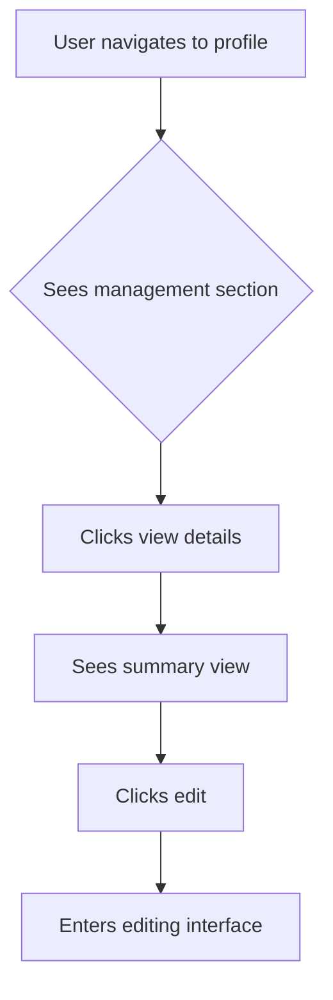

# Writing design specs

> **This is a process document.** Follow these steps in order.
> Refer to the planning skill's SKILL.md for shared concepts
> (prerequisites, checkpoints, wiki management).

This stage guides the creation of design specifications for features with user interfaces.

## Output

Creates a `## Design spec` section within the feature artifact containing:
- User flow diagrams (using Mermaid)
- Key UI component descriptions
- Visual references (screenshots, mockups)

## Prerequisite checklist

Before starting, verify these exist. Follow the planning skill's prerequisite checking pattern for how to handle gaps.

- [ ] UI components documented in `{docs_root}/wiki/design-system.md`?
- [ ] Design tokens defined (colors, spacing, typography)?
- [ ] Navigation and form patterns established?
- [ ] Error handling and loading state patterns defined?
- [ ] Major UI framework choices documented in `{docs_root}/adrs/`?
- [ ] Dependent UI components from other features exist?

## Process

### 1. Create user flows

**Format**: Mermaid flowchart or graph diagrams

**You MUST**:
- Show how users navigate through the feature
- Focus on key flows, not every edge case
- Show decision points and branching paths
- Split complex flows into multiple diagrams

**Example:**



**CHECKPOINT**: Get human approval on user flows before proceeding

### 2. Describe key UI components

For each major UI component, describe:

- Purpose and functionality
- Visual appearance (only if different from design system defaults)
- Interactive behaviors
- States (default, hover, disabled, etc.)

**Example:**

```markdown
#### Role management view

- Container displaying list of roles as cards
- Each card shows role name and "View details" button
- Primary role has visual "Primary" badge
- "Add role" button opens modal for role selection
```

**You MUST**:
- Only specify details that differ from the existing design system
- Focus on what's new or changing
- Do NOT document standard components that remain unchanged

**CHECKPOINT**: Get human approval on components before proceeding

### 3. Add visual references

Include mockups, screenshots, or examples when:
- Design is novel or complex
- Visual details are critical
- Alignment with brand/design system needs verification

## When to skip

**Default to creating design specs** for any feature with UI elements. Only skip when ALL of the following are true:

- Feature is backend-only (APIs, data processing, no UI changes)
- OR: Changes are purely functional with zero visual or interaction changes
- OR: User explicitly says no design work needed

**Do NOT skip design specs for these reasons:**
- "We have a design-system.md" — the design system defines components, but you still need to show how they compose for this feature
- "The narratives describe the experience" — narratives show user stories, not UI flows and component specifications
- "We're using BlockNote/TipTap/other UI library" — third-party libraries provide building blocks, not feature design
- "It's a small feature" — small features still need design specs if they have UI elements

**When uncertain**: Create the design spec.

## Key guidelines

- Examine codebase first to understand current implementation
- Propose designs proactively based on product requirements
- Be prepared to iterate based on human feedback
- Effort split: collaborative (50% you, 50% human)

For patterns and examples, see:
- `references/examples/design-spec.md` — complete design spec example
